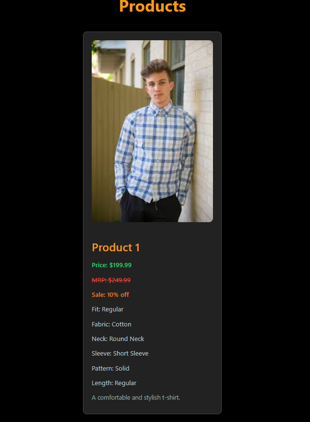

Based on the information from the assignment, here's a README file that you can use for your GitHub repository:

```markdown
# Nobero Web Scraper & React Application

## Introduction

This project is a web scraping and web application development assignment designed to demonstrate proficiency in Python, Scrapy, Django REST framework, and ReactJS. The goal is to scrape product data from the [Nobero](https://nobero.com/pages/men) website (specifically from the men's category), store the scraped data in a database, and create a ReactJS-based web application that displays the products with filtering capabilities.

## Table of Contents

- [Introduction](#introduction)
- [Features](#features)
- [Installation](#installation)
- [Usage](#usage)
- [Project Structure](#project-structure)
- [Configuration](#configuration)
- [API Documentation](#api-documentation)
- [Screenshots](#screenshots)
- [Troubleshooting](#troubleshooting)
- [Contributors](#contributors)
- [License](#license)

## Features

- **Web Scraping**: Scrapes product data from the Nobero website using Scrapy and stores it in JSON or a database.
- **Django REST API**: Exposes the scraped data via a RESTful API.
- **ReactJS Web Application**: Displays the products on a homepage with filtering options and navigates to individual product pages on click.
- **Extensibility**: The scraping and API code are designed to be easily extendable to other categories, such as women's apparel.

## Installation

### Prerequisites

- Python 3.8+
- Node.js 14+
- Django 4.0+
- React 17+
- Scrapy 2.5+
- PostgreSQL (or any other preferred database)

### Steps

1. **Clone the repository**:
    ```bash
    git clone https://github.com/Ronak1414/nobero-scraper-react-app.git
    cd nobero-scraper-react-app
    ```

2. **Set up the Python environment**:
    ```bash
    python -m venv venv
    source venv/bin/activate  # On Windows use `venv\Scripts\activate`
    pip install -r requirements.txt
    ```

3. **Run the Scrapy spider**:
    ```bash
    scrapy crawl nobero_spider
    ```

4. **Set up the Django server**:
    - Navigate to the `backend` directory.
    - Apply migrations and run the server:
    ```bash
    python manage.py migrate
    python manage.py runserver
    ```

5. **Set up the React application**:
    - Navigate to the `frontend` directory.
    - Install dependencies and start the development server:
    ```bash
    npm install
    npm start
    ```

## Usage

- **Scraping**: The `nobero_spider` scrapes product details like title, price, available SKUs, and more. The scraped data is saved to a database.
- **API**: The Django REST framework exposes the data via endpoints which can be consumed by the ReactJS frontend.
- **Frontend**: The ReactJS app allows users to browse through the products and view detailed information on individual product pages.

## Project Structure

```plaintext
nobero-scraper-react-app/
│
├── backend/                 # Django backend code
│   ├── manage.py
│   ├── db.sqlite3           # SQLite database (for demo)
│   ├── scraping/            # Scrapy project for scraping data
│   └── api/                 # Django REST framework app
│
├── frontend/                # ReactJS frontend code
│   ├── public/
│   └── src/
│       ├── components/
│       └── App.js
│
├── requirements.txt         # Python dependencies
├── package.json             # Node.js dependencies
└── README.md                # This file
```

## Configuration

### Scrapy Settings
The Scrapy settings can be configured in the `scraping/settings.py` file. Modify the user agent, request delays, and pipelines as necessary.

### Django Settings
Database and API configurations can be modified in the `backend/settings.py` file. Update the database settings to use your preferred database.

## API Documentation

The Django REST API exposes the following endpoints:

- `/api/products/` - GET request to fetch all products.
- `/api/products/{id}/` - GET request to fetch a single product by ID.

## Screenshots


### React Application Home Page



## Troubleshooting

- **Scrapy Errors**: Ensure that the target website's structure has not changed. Update the scraping logic if necessary.
- **Django Server Issues**: Verify that your database is correctly configured and accessible.
- **ReactJS Errors**: Ensure all necessary dependencies are installed, and the API server is running.

## Contributors

- **Ronak** - Initial work

## License

This project is licensed under the MIT License - see the [LICENSE](LICENSE) file for details.
```

